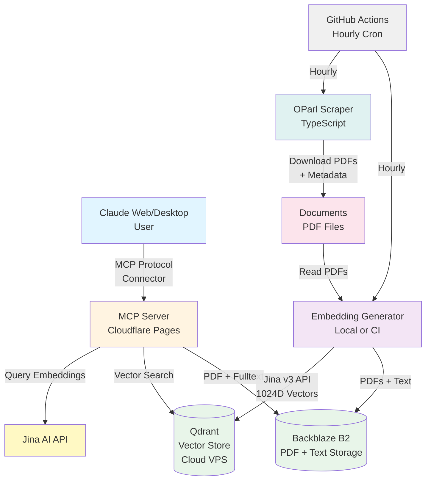

# Nordstemmen Transparent

**Durchsuche alle öffentlichen Dokumente der Gemeinde Nordstemmen mit KI-Unterstützung - direkt in Claude!**

## 🚀 Jetzt sofort nutzen

Du kannst diese Suchmaschine **sofort kostenlos nutzen**, ohne irgendetwas zu installieren:

### Für Claude 

1. Gehe zu https://claude.ai
2. Klicke auf dein Profil (unten links) → **Settings** -> **Connectors**
3. Klicke auf **Add Custom Connector**
4. Trage ein:
   - **Name**: Gemeinde Nordstemmen
   - **URL**: `https://nordstemmen-mcp.levinkeller.de/mcp`
5. Speichern

Fertig! Jetzt kannst du Claude fragen:
- *"Was kostet das neue Schwimmbad in Nordstemmen?"*
- *"Zeige mir alle Beschlüsse zum Baugebiet Escherder Straße"*
- *"Wann wurde der Haushalt 2024 beschlossen?"*

Claude durchsucht automatisch alle Dokumente seit 2007 und gibt dir Antworten mit Links zu den Originaldokumenten im Ratsinformationssystem.

### Für ChatGPT

Du brauchst einen bezahlten Account (z.B. Plus) und musst unter https://chatgpt.com/ eingeloggt sein.

1. Klicke auf dein Profil (unten links) → **Einstellungen** -> **Apps und Konnektoren**.
2. Unter **Erweiterte Einstellungen** den **Entwicklermodus** aktivieren (falls noch nicht aktiv). Danach auf **Zurück** klicken.
3. Rechts oben auf **Erstellen** klicken und Folgendes eintragen:
   - **Name**: Gemeinde Nordstemmen
   - **URL des MCP-Servers**: `https://nordstemmen-mcp.levinkeller.de/mcp`
   - **Authentifizierung**: Keine Authentifizierung
4. Die **Ich verstehe und ich möchte fortfahren**-Checkbox anklicken und auf **Erstellen** klicken.

Der Konnektor ist nun eingerichtet und bereit zur Verwendung. Öffne dafür einen **neuen Chat** und wähle über das **+**-Symbol links im Eingabefeld → **... Mehr** → **Gemeinde Nordstemmen** aus.

Jetzt kannst du ChatGPT Fragen zu den Gemeindedokumenten stellen – Beispiele findest du oben.

Beim ersten Aufruf einer Aktion musst du diesen aus Sicherheitsgründen bestätigen. Du kannst dabei die Option **Für dieses Gespräch merken** aktivieren, um die Anzahl der Rückfragen zu reduzieren. Da der Konnektor mehrere Aktionstypen bereitstellt, können dennoch gelegentlich weitere Bestätigungen notwendig sein.

---

## Was ist das?

Dieses Projekt ermöglicht semantische Suche in **allen öffentlichen Dokumenten** des Ratsinformationssystems der Gemeinde Nordstemmen:
- Sitzungsprotokolle (Gemeinderat, Ortsräte, Ausschüsse)
- Beschlussvorlagen und Beschlüsse
- Haushaltspläne und Finanzberichte
- Bebauungspläne und Planungsunterlagen
- Bekanntmachungen und Ausschreibungen

**Zeitraum:** Alle Dokumente ab 2007 bis heute (wird automatisch aktualisiert)

Die semantische KI-Suche findet relevante Informationen auch wenn die exakten Suchbegriffe nicht im Text vorkommen.

## Technischer Überblick (für Entwickler)

Das Projekt besteht aus vier Komponenten:

1. **OParl Scraper** - Lädt PDF-Dokumente vom Ratsinformationssystem herunter
2. **Embedding Generator** - Verarbeitet PDFs und erstellt Vektorembeddings mit Jina AI v3 (lokal oder via API)
3. **MCP Server** - Cloudflare Pages Function für semantische Suche via Claude (Web & Desktop)
4. **CI Pipeline** - GitHub Actions Cronjob synchronisiert stündlich neue Dokumente

## Architektur



### Warum Hybrid-Ansatz?

- **Dokument-Embeddings**: Jina AI API in CI, oder lokal mit Jina v3 Modell (einmalig, kostenlos)
- **Query-Embeddings**: Jina AI API (häufig, niedrige Kosten pro Query, keine GPU nötig)
- **Vector Search**: Qdrant Cloud (persistente Speicherung, schnelle Suche)
- **MCP Server**: Cloudflare Pages (kostenloses Hosting, globales CDN, niedrige Latenz)
- **PDF/Text Storage**: Backblaze B2 (günstig, per SHA256-Hash adressiert)
- **CI Pipeline**: GitHub Actions (stündliche Synchronisierung, LFS-optimiert)

## Repository-Struktur

```
nordstemmen-ai/
├── .github/workflows/
│   ├── data-sync.yml      # Stündlicher CI-Cronjob für Datenaktualisierung
│   └── claude.yml         # Claude Code Action
├── documents/              # Heruntergeladene PDFs und Metadaten
│   ├── papers/            # Drucksachen (nach OParl-ID)
│   └── meetings/          # Sitzungen (nach OParl-ID)
├── scraper/               # OParl Scraper (TypeScript)
│   ├── src/
│   │   ├── index.ts       # CLI Entry Point
│   │   ├── scraper.ts     # OParl Scraper Logic
│   │   ├── client.ts      # HTTP Client
│   │   └── schema.ts      # OParl Type Definitions
│   └── package.json
├── embeddings/            # Embedding Generator (Python)
│   ├── generate_embeddings.py  # PDF → Embeddings (lokal oder API)
│   ├── upload_to_qdrant.py     # Embeddings → Qdrant
│   ├── requirements.txt        # Dependencies (mit PyTorch, lokal)
│   └── requirements-ci.txt     # Dependencies (ohne PyTorch, CI)
├── scripts/
│   └── upload_to_b2.py    # PDFs + Volltext → Backblaze B2
├── mcp-server/            # MCP Server (Cloudflare Pages)
│   ├── functions/
│   │   ├── mcp.js         # MCP Protocol Handler + Tools
│   │   └── pdf/[[sha256]].js  # PDF Proxy (B2 → CDN)
│   └── package.json
├── docs/
│   └── github-secrets.md  # CI Secret-Dokumentation
├── .env.example
├── .gitignore
├── LICENSE
└── README.md
```

## Setup

### Voraussetzungen

- **Python 3.11+** (für Embedding Generator)
- **Node.js 18+** (für Scraper und MCP Server)
- **Qdrant Cloud Instanz** oder selbst deployed
- **Jina AI API Key** (kostenlos bei https://jina.ai)
- **Claude Account** (Web oder Desktop App für MCP Integration)

### 1. Repository klonen

```bash
git clone https://github.com/yourusername/nordstemmen-ai.git
cd nordstemmen-ai

# PDFs herunterladen (Git LFS)
git lfs pull
```

**Wichtig:** Die PDF-Dokumente werden via Git LFS verwaltet. Nach dem Clone muss `git lfs pull` ausgeführt werden, um die Dateien tatsächlich herunterzuladen.

### 2. Umgebungsvariablen konfigurieren

```bash
cp .env.example .env
```

Bearbeite `.env` und füge deine Credentials ein:

```bash
# Qdrant Configuration
QDRANT_URL=https://xyz-abc-123.eu-central-1.aws.cloud.qdrant.io
QDRANT_API_KEY=your-qdrant-api-key
QDRANT_PORT=443
QDRANT_COLLECTION=nordstemmen

# Jina AI API (für Query Embeddings)
JINA_API_KEY=jina_abcdef1234567890

# Environment (optional)
ENVIRONMENT=production
```

**Wo bekomme ich die Keys?**

- **Qdrant**: https://cloud.qdrant.io (Free Tier: 1GB)
- **Jina AI**: https://jina.ai (Free Tier: 1M tokens/month)

### 3. OParl Scraper Setup

```bash
cd scraper
npm install
```

**Scraper ausführen:**

```bash
npm start
```

**Was passiert:**
- Traversiert OParl-API der Gemeinde Nordstemmen
- Lädt neue/geänderte PDF-Dokumente herunter
- Speichert Metadaten (Datum, Name, Gremium, URL) in `documents/metadata.json`
- Erkennt bereits heruntergeladene Dokumente via OParl-ID

**Output:**
```
documents/
├── 2024-11-12_Gemeinderat_Protokoll.pdf
├── 2024-10-15_Bauausschuss_Beschluss.pdf
├── 2023-05-20_Haushalt_Vorlage.pdf
└── metadata.json
```

### 4. Embedding Generator Setup

```bash
cd embeddings
python -m venv venv
source venv/bin/activate  # Windows: venv\Scripts\activate
pip install -r requirements.txt      # Lokal (mit PyTorch)
# oder: pip install -r requirements-ci.txt  # CI (ohne PyTorch, nutzt Jina API)
```

**Embeddings generieren:**

```bash
python generate_embeddings.py                # Lokal mit GPU/CPU
JINA_API_KEY=xxx python generate_embeddings.py  # Via Jina API (kein PyTorch nötig)
```

**Was passiert:**
1. Lädt Jina Embeddings v3 Modell lokal oder nutzt Jina API (wenn `JINA_API_KEY` gesetzt)
2. Liest alle PDFs aus `documents/` (überspringt Git LFS Pointer)
3. Berechnet SHA256-Hash pro PDF
4. Prüft Cache: "Bereits verarbeitet?"
5. Bei neuen/geänderten PDFs:
   - Text extrahieren (pdfplumber, Fallback: OCR)
   - Volltext als `.fulltext.json` speichern (für B2-Upload)
   - Text in Chunks aufteilen (1000 Zeichen, 200 Overlap, LangChain)
   - Embeddings generieren mit `task='retrieval.passage'`
   - Embeddings als `.embeddings.json` speichern

**Output:**
```
🚀 Initializing Embedding Generator...
✓ Connected to Qdrant
📦 Loading model: jinaai/jina-embeddings-v3
✓ Model loaded (1024D vectors)
✓ Loaded metadata for 150 files

📁 Found 150 PDF files

Processing: 100%|████████| 150/150 [08:42<00:00] Skipped: 145 | 2024-11-12.pdf

✅ Processing complete! (Skipped 145 already processed)
```

**Hash-basierte Change Detection:**
- Der Generator trackt bereits verarbeitete Dateien via SHA256-Hash in Qdrant
- Bei erneutem Ausführen werden nur neue/geänderte PDFs verarbeitet
- Kein lokaler State nötig - Qdrant ist Single Source of Truth
- Prozess kann jederzeit gestoppt und später fortgesetzt werden

**Embedding Modell:**
- **jinaai/jina-embeddings-v3** (570M Parameter, 8192 Token Context)
- **1024 Dimensionen**
- Task-spezifische LoRA Adapter: `retrieval.passage` für Dokumente
- Deutsch-taugliches Modell mit State-of-the-Art Performance

### 5. MCP Server Deployment (Cloudflare Pages)

Der MCP Server ist eine Cloudflare Pages Function, die:
- Semantische Suche via Jina AI API + Qdrant bereitstellt
- MCP Protocol implementiert für Claude Desktop
- Deep Links zu Originaldokumenten im Ratsinformationssystem zurückgibt
- Fehler in Production sanitiert (keine API-Details an User)

#### Deployment-Schritte

**1. Cloudflare Pages Projekt erstellen:**

```bash
cd mcp-server
npm install
```

**2. Deployment via Cloudflare Dashboard:**

1. Gehe zu https://dash.cloudflare.com
2. Pages → Create a project → Connect to Git
3. Wähle dieses GitHub Repository
4. **Build-Konfiguration:**
   - Framework preset: **None**
   - Build command: **`npm install`**
   - Build output directory: **(leer lassen)**
   - Root directory: `/mcp-server`

5. **Environment Variables** (Settings → Environment variables):
   ```
   QDRANT_URL=https://your-qdrant-instance.example.com
   QDRANT_API_KEY=your-api-key
   QDRANT_PORT=443
   QDRANT_COLLECTION=nordstemmen
   JINA_API_KEY=your-jina-api-key
   ENVIRONMENT=production
   ```

6. Deploy!

**Beispiel-URL (kann mit Custom Domain angepasst werden):**
```
https://nordstemmen-mcp.levinkeller.de
```

Für dieses Projekt: `https://nordstemmen-mcp.levinkeller.de/mcp`

#### Lokales Testen

```bash
npm test
```

Tests umfassen:
- MCP Protocol Endpoints (`initialize`, `tools/list`, `tools/call`)
- Einzelne und Batch-Requests
- Embedding Model Verfügbarkeit (HuggingFace vs. Jina AI)

### 6. Claude Integration

**Der MCP Server ist live unter `https://nordstemmen-mcp.levinkeller.de/mcp`**

Die Anleitung zur Einbindung in Claude findest du ganz oben unter [🚀 Jetzt sofort nutzen](#-jetzt-sofort-nutzen).

### 7. Automatische Datenaktualisierung (CI)

Die Daten werden **stündlich automatisch** via GitHub Actions aktualisiert:

1. **Scraper** lädt neue Dokumente von der OParl-API
2. **Embedding Generator** verarbeitet neue PDFs (via Jina API)
3. **B2-Upload** lädt PDFs und Volltext nach Backblaze B2
4. **Qdrant-Upload** lädt neue Embeddings hoch
5. **Git Commit** speichert neue Dateien (LFS für PDFs/Embeddings)

Der Workflow nutzt `GIT_LFS_SKIP_SMUDGE=1` beim Checkout, sodass nur LFS-Pointer geladen werden. Neue Dateien vom Scraper sind echte Dateien. So bleibt der CI-Job schnell (~2-3 Min wenn keine neuen Daten).

**Manuell auslösen:** GitHub Actions > Data Sync > Run workflow

**Benötigte Secrets:** Siehe [docs/github-secrets.md](docs/github-secrets.md)

## MCP Tool: `search_documents`

Das MCP Tool bietet semantische Suche über alle Dokumente:

**Input:**
```json
{
  "query": "Schwimmbad Kosten",
  "limit": 5
}
```

**Output:**
```json
{
  "content": [
    {
      "type": "text",
      "text": "1. [Haushaltsbeschluss 2024](https://nordstemmen.de/...) • 2024-11-12 • Score: 0.892\n\nDer Gemeinderat beschließt den Haushalt 2024 mit einem Budget von 2,5 Mio € für das neue Schwimmbad..."
    }
  ],
  "structuredContent": {
    "results": [
      {
        "rank": 1,
        "title": "Haushaltsbeschluss 2024",
        "url": "https://nordstemmen.de/...",
        "date": "2024-11-12",
        "page": 3,
        "score": 0.892,
        "excerpt": "Der Gemeinderat beschließt...",
        "filename": "2024-11-12_Gemeinderat.pdf"
      }
    ]
  }
}
```

**Features:**
- Semantische Suche (findet relevante Dokumente auch ohne exakte Keywords)
- Deep Links zu Originaldokumenten im Ratsinformationssystem
- Markdown-Formatierung für Claude (Text)
- Strukturierte JSON-Daten für programmatischen Zugriff
- Relevanz-Score (Cosine Similarity)

## Qdrant Payload Schema

Jeder Chunk wird mit folgendem Schema gespeichert:

```json
{
  "vector": [0.123, -0.456, ...],  // 1024 Dimensionen (Jina v3)
  "payload": {
    "filename": "documents/2024-11-12_Gemeinderat_Protokoll.pdf",
    "file_hash": "abc123def456...",
    "page": 3,
    "chunk_index": 5,
    "text": "Der Gemeinderat beschließt...",
    "source": "oparl",

    // OParl Metadata
    "oparl_id": "https://nordstemmen.de/api/oparl/v1/paper/123",
    "date": "2024-11-12",
    "name": "Haushaltsbeschluss 2024",
    "mime_type": "application/pdf",
    "access_url": "https://nordstemmen.de/buergerinfo/..."
  }
}
```

**Metadaten-Quelle:** `documents/metadata.json` (vom Scraper generiert)

## Entwicklung

### Code-Struktur

**`embeddings/generate.py`:**
- `EmbeddingGenerator.__init__()` - Initialisierung (Qdrant, Jina v3 Model)
- `process_pdf()` - Single PDF verarbeiten, returns bool (skipped?)
- `process_all()` - Alle PDFs mit tqdm Progress Bar
- `_is_already_processed()` - Hash-basierte Change Detection
- `_delete_old_chunks()` - Alte Chunks bei File-Änderung löschen

**`mcp-server/_worker.js`:**
- `generateEmbedding()` - Jina AI API Call für Query Embeddings
- `searchDocuments()` - Qdrant Search mit Cosine Similarity
- `handleMCPRequest()` - MCP Protocol Handler (initialize, tools/list, tools/call)
- `sanitizeError()` - Production Error Sanitization

### Logging

**Embedding Generator:**
```
🚀 Initializing...
✓ Connected to Qdrant
📦 Loading model: jinaai/jina-embeddings-v3
✓ Model loaded (1024D vectors)
📁 Found 150 PDF files

Processing: |████| 45/150 [02:30] Skipped: 42 | filename.pdf

✅ Complete! (Skipped 145 already processed)
```

**MCP Server:**
- Nur Errors/Warnings werden geloggt
- In Production: Sanitierte Error Messages (keine API-Details)
- In Development: Volle Error Messages mit Stack Traces

### Testing

**Embedding Generator:**
```bash
cd embeddings
source venv/bin/activate

# Test connection
python test_connection.py

# Test query
python test_query.py "Schwimmbad Kosten"

# Drop collection (⚠️ VORSICHT!)
python drop_collection.py
```

**MCP Server:**
```bash
cd mcp-server

# All tests
npm test

# Watch mode
npm run test:watch

# Single test
npm test -- _worker.test.js
```

### Re-Processing erzwingen

**Option 1: PDF ändern**
```bash
# Touch the file to change modification date
touch documents/2024-11-12_Gemeinderat.pdf
python embeddings/generate.py
```

**Option 2: Qdrant Chunks löschen**
```python
# embeddings/delete_specific.py
from qdrant_client import QdrantClient
from qdrant_client.models import Filter, FieldCondition, MatchValue

client = QdrantClient(url=QDRANT_URL, api_key=QDRANT_API_KEY)
client.delete(
    collection_name="nordstemmen",
    points_selector=Filter(
        must=[
            FieldCondition(
                key="filename",
                match=MatchValue(value="documents/2024-11-12_Gemeinderat.pdf")
            )
        ]
    )
)
```

**Option 3: Collection komplett löschen**
```bash
cd embeddings
python drop_collection.py  # ⚠️ VORSICHT: Löscht ALLE Embeddings!
python generate.py         # Alles neu verarbeiten
```

## Kosten & Performance

### Jina AI API
- **Free Tier**: 1M tokens/month
- **Kosten danach**: ~$0.02 / 1M tokens
- **Typischer Query**: ~50 tokens
- **→ ~20.000 Queries kostenlos/Monat**

### Qdrant Cloud
- **Free Tier**: 1GB Storage
- **~150 PDFs**: ~500MB (mit 1024D Embeddings)
- **Kosten danach**: ~$25/month für 4GB

### Cloudflare Pages
- **Free Tier**: 100.000 Requests/Tag
- **Kosten danach**: $0.50 / 1M Requests
- **→ Effektiv kostenlos für diesen Use Case**

### Embedding Generation (Lokal)
- **Jina v3 Model**: ~2GB VRAM
- **150 PDFs**: ~8-10 Minuten (M1/M2 Mac)
- **Kosten**: $0 (lokal)

## Datenschutz & Transparenz

- **Keine Nutzer-Tracking**: MCP Server speichert keine Queries
- **Öffentliche Daten**: Nur bereits öffentliche Dokumente aus dem Ratsinformationssystem
- **Keine Personenbezogene Daten**: Embeddings enthalten keine PII
- **Open Source**: MIT License, voller Code auf GitHub
- **Unabhängiges Projekt**: Keine offizielle Gemeinde-Anwendung

## Status

**Das Projekt ist produktiv und funktionsfähig!**

✅ OParl Scraper (TypeScript)
✅ Embedding Generator mit Jina v3 (lokal + API-Modus)
✅ MCP Server live unter https://nordstemmen-mcp.levinkeller.de/mcp
✅ Hash-basierte Change Detection
✅ Deep Links zu Originaldokumenten
✅ Robuste PDF-Verarbeitung mit pdfplumber + OCR
✅ Volltext-Abruf via MCP Tool (`get_document_text`)
✅ Stündliche automatische Datenaktualisierung (GitHub Actions CI)
✅ PDF + Volltext Storage auf Backblaze B2

Der MCP Server ist öffentlich nutzbar - siehe [🚀 Jetzt sofort nutzen](#-jetzt-sofort-nutzen) am Anfang der README.

## Support & Beitragen

**Issues:** https://github.com/yourusername/nordstemmen-ai/issues

**Pull Requests sind willkommen!** Bitte:
1. Fork das Repo
2. Branch erstellen (`git checkout -b feature/amazing-feature`)
3. Committen (`git commit -m 'Add amazing feature'`)
4. Push (`git push origin feature/amazing-feature`)
5. Pull Request öffnen

## Lizenz

MIT License - siehe [LICENSE](LICENSE)

---

**Hinweis:** Dies ist ein unabhängiges Transparenz-Tool und keine offizielle Anwendung der Gemeinde Nordstemmen.

**Entwickelt mit:** Claude Code
