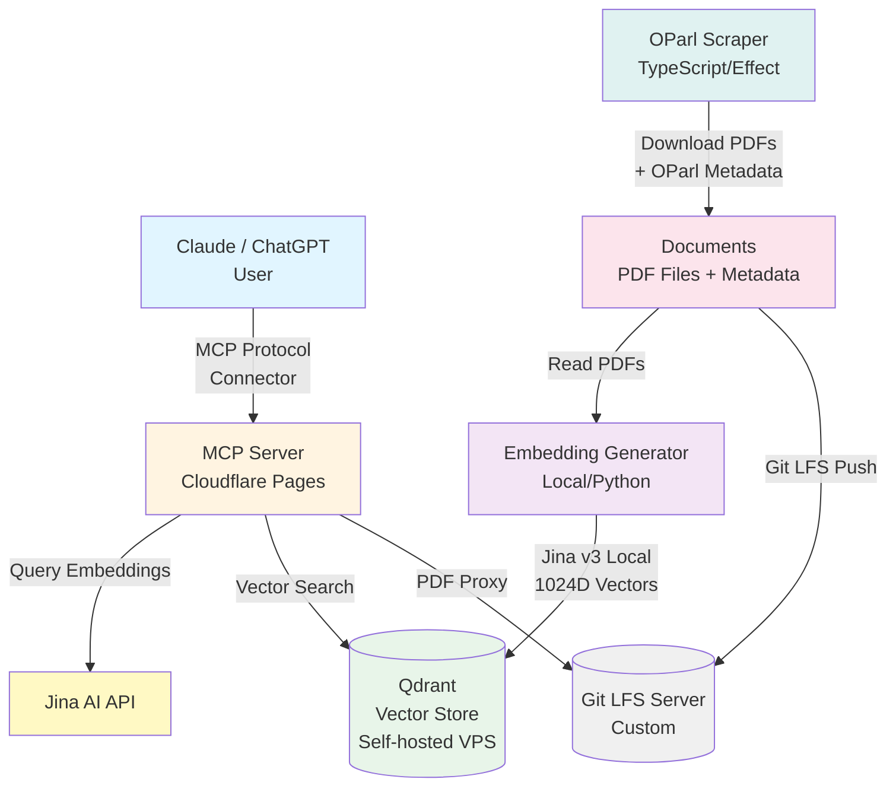

# Nordstemmen Transparent

**Durchsuche alle öffentlichen Dokumente der Gemeinde Nordstemmen mit KI-Unterstützung - direkt in Claude!**

## 🚀 Jetzt sofort nutzen

Du kannst diese Suchmaschine **sofort kostenlos nutzen**, ohne irgendetwas zu installieren:

### Für Claude 

1. Gehe zu https://claude.ai
2. Klicke auf dein Profil (unten links) → **Settings** -> **Connectors**
3. Klicke auf **Add Custom Connector**
4. Trage ein:
   - **Name**: Gemeinde Nordstemmen
   - **URL**: `https://nordstemmen-mcp.levinkeller.de/mcp`
5. Speichern

Fertig! Jetzt kannst du Claude fragen:
- *"Was kostet das neue Schwimmbad in Nordstemmen?"*
- *"Zeige mir alle Beschlüsse zum Baugebiet Escherder Straße"*
- *"Wann wurde der Haushalt 2024 beschlossen?"*

Claude durchsucht automatisch alle Dokumente seit 2007 und gibt dir Antworten mit Links zu den Originaldokumenten im Ratsinformationssystem.

### Für ChatGPT

Du brauchst einen bezahlten Account (z.B. Plus) und musst unter https://chatgpt.com/ eingeloggt sein.

1. Klicke auf dein Profil (unten links) → **Einstellungen** -> **Apps und Konnektoren**.
2. Unter **Erweiterte Einstellungen** den **Entwicklermodus** aktivieren (falls noch nicht aktiv). Danach auf **Zurück** klicken.
3. Rechts oben auf **Erstellen** klicken und Folgendes eintragen:
   - **Name**: Gemeinde Nordstemmen
   - **URL des MCP-Servers**: `https://nordstemmen-mcp.levinkeller.de/mcp`
   - **Authentifizierung**: Keine Authentifizierung
4. Die **Ich verstehe und ich möchte fortfahren**-Checkbox anklicken und auf **Erstellen** klicken.

Der Konnektor ist nun eingerichtet und bereit zur Verwendung. Öffne dafür einen **neuen Chat** und wähle über das **+**-Symbol links im Eingabefeld → **... Mehr** → **Gemeinde Nordstemmen** aus.

Jetzt kannst du ChatGPT Fragen zu den Gemeindedokumenten stellen – Beispiele findest du oben.

Beim ersten Aufruf einer Aktion musst du diesen aus Sicherheitsgründen bestätigen. Du kannst dabei die Option **Für dieses Gespräch merken** aktivieren, um die Anzahl der Rückfragen zu reduzieren. Da der Konnektor mehrere Aktionstypen bereitstellt, können dennoch gelegentlich weitere Bestätigungen notwendig sein.

---

## Was ist das?

Dieses Projekt ermöglicht semantische Suche in **allen öffentlichen Dokumenten** des Ratsinformationssystems der Gemeinde Nordstemmen:
- Sitzungsprotokolle (Gemeinderat, Ortsräte, Ausschüsse)
- Beschlussvorlagen und Beschlüsse
- Haushaltspläne und Finanzberichte
- Bebauungspläne und Planungsunterlagen
- Bekanntmachungen und Ausschreibungen

**Zeitraum:** Alle Dokumente ab 2007 bis heute (wird automatisch aktualisiert)

Die semantische KI-Suche findet relevante Informationen auch wenn die exakten Suchbegriffe nicht im Text vorkommen.

## Technischer Überblick (für Entwickler)

Das Projekt besteht aus drei Komponenten:

1. **OParl Scraper** - Lädt PDF-Dokumente und Metadaten vom Ratsinformationssystem herunter (TypeScript, Effect)
2. **Embedding Generator** - Verarbeitet PDFs lokal, erstellt Vektorembeddings mit Jina AI v3, cached Ergebnisse (Python)
3. **MCP Server** - Cloudflare Pages Functions für semantische Suche und Drucksachen-Lookup (JavaScript, Vite)

## Architektur



### Warum Hybrid-Ansatz?

- **Dokument-Embeddings**: Lokal mit Jina v3 (einmalig, hohe Rechenleistung, kostenlos)
- **Query-Embeddings**: Jina AI API (häufig, niedrige Kosten pro Query, keine GPU nötig)
- **Vector Search**: Qdrant (self-hosted VPS, persistente Speicherung, schnelle Suche)
- **MCP Server**: Cloudflare Pages (kostenloses Hosting, globales CDN, niedrige Latenz)
- **PDF Storage**: Git LFS mit eigenem Server (kostengünstig, versioniert)

## Repository-Struktur

```
nordstemmen-ai/
├── documents/                    # Heruntergeladene PDFs + Metadaten (Git LFS)
│   ├── metadata.json             # Master-Index aller Dateien
│   ├── papers/                   # ~1578 Drucksachen-Ordner
│   │   └── DS_<nr>-<jahr>/
│   │       ├── metadata.json     # OParl Paper-Metadaten
│   │       ├── *.pdf             # Haupt- und Anlagendateien
│   │       └── *.embeddings.json # Cached Embeddings (LFS)
│   └── meetings/                 # ~1087 Sitzungs-Ordner
│       └── <datum>_<name>/
│           ├── metadata.json     # OParl Meeting-Metadaten
│           ├── *.pdf             # Einladung, Protokoll, Anlagen
│           └── *.embeddings.json # Cached Embeddings (LFS)
├── scraper/                      # OParl Scraper (TypeScript, Effect)
│   ├── src/
│   │   ├── index.ts              # CLI Entry Point
│   │   ├── scraper.ts            # OParl Scraper Logic
│   │   ├── client.ts             # HTTP Client
│   │   ├── schema.ts             # OParl Type Definitions
│   │   └── __tests__/            # Tests (vitest + nock fixtures)
│   ├── package.json
│   ├── tsconfig.json
│   ├── vitest.config.ts
│   └── README.md                 # Detaillierte OParl-Datenmodell-Doku
├── embeddings/                   # Embedding Generator (Python)
│   ├── generate_embeddings.py    # PDF → Text → Chunks → Embeddings
│   ├── upload_to_qdrant.py       # Upload Embeddings nach Qdrant
│   ├── migrate_embeddings.py     # Migrations-Utility
│   ├── drop_collection.py        # Qdrant Collection löschen
│   ├── inspect_data.py           # Daten-Inspektion
│   ├── test_*.py                 # Diverse Test-Skripte
│   ├── requirements.txt
│   └── README.md
├── mcp-server/                   # MCP Server (Cloudflare Pages)
│   ├── functions/
│   │   ├── mcp.js                # MCP-Implementierung (3 Tools)
│   │   └── pdf/
│   │       └── [[sha256]].js     # PDF-Proxy (stellt PDFs per Hash bereit)
│   ├── src/
│   │   ├── index.html            # Landing Page
│   │   └── style.css             # Tailwind CSS Styles
│   ├── mcp-server.test.js        # MCP-Protokoll-Tests
│   ├── pdf-proxy.test.js         # PDF-Proxy-Tests
│   ├── package.json
│   ├── vite.config.js            # Build-Konfiguration
│   ├── vitest.config.js          # Test-Konfiguration
│   ├── tailwind.config.js
│   └── README.md                 # API-Doku, Deployment-Guide
├── scripts/
│   ├── lfs-repair.sh             # Git LFS Pointer-Dateien reparieren
│   └── update-hashes-to-sha256.py
├── .github/workflows/
│   └── claude.yml                # Claude Code Action (@claude in Issues/PRs)
├── .devcontainer/
│   └── devcontainer.json         # Dev Container: Node 22, Python, Git LFS, poppler
├── .env.example                  # Template für Umgebungsvariablen
├── .gitattributes                # Git LFS Tracking (*.pdf, *.embeddings.json)
├── .lfsconfig                    # Custom LFS Server Konfiguration
├── biome.json                    # Linter/Formatter (Biome)
├── package.json                  # Root Workspace (scraper + mcp-server)
├── CLAUDE.md                     # Projekt-Kontext für KI-Assistenten
├── CHANGELOG.md                  # Änderungsprotokoll
├── .gitignore
├── LICENSE                       # MIT License
└── README.md
```

## Setup

### Voraussetzungen

- **Python 3.11+** (für Embedding Generator)
- **Node.js 18+** (für Scraper und MCP Server)
- **Qdrant Cloud Instanz** oder selbst deployed
- **Jina AI API Key** (kostenlos bei https://jina.ai)
- **Claude Account** (Web oder Desktop App für MCP Integration)

### 1. Repository klonen

```bash
git clone https://github.com/levinkeller/nordstemmen-ai.git
cd nordstemmen-ai

# PDFs herunterladen (Git LFS)
# Hinweis: Nutzt eigenen LFS-Server (konfiguriert in .lfsconfig)
npm run lfs-pull
```

**Wichtig:** Die PDF-Dokumente und Embedding-Caches werden via Git LFS verwaltet, mit einem eigenen LFS-Server (`git-lfs.nordstemmen-ai.levinkeller.de`). Die `.lfsconfig` hat `fetchexclude = *` gesetzt, d.h. LFS-Dateien werden beim Clone nicht automatisch heruntergeladen. `npm run lfs-pull` lädt alle LFS-Dateien explizit herunter.

### 2. Umgebungsvariablen konfigurieren

```bash
cp .env.example .env
```

Bearbeite `.env` und füge deine Credentials ein:

```bash
# Qdrant Configuration
QDRANT_URL=https://xyz-abc-123.eu-central-1.aws.cloud.qdrant.io
QDRANT_API_KEY=your-qdrant-api-key
QDRANT_PORT=443
QDRANT_COLLECTION=nordstemmen

# Jina AI API (für Query Embeddings)
JINA_API_KEY=jina_abcdef1234567890

# Environment (optional)
ENVIRONMENT=production
```

**Wo bekomme ich die Keys?**

- **Qdrant**: https://cloud.qdrant.io (Free Tier: 1GB)
- **Jina AI**: https://jina.ai (Free Tier: 1M tokens/month)

### 3. OParl Scraper Setup

```bash
cd scraper
npm install
```

**Scraper ausführen:**

```bash
npm run scrape
```

**Was passiert:**
- Traversiert OParl-API der Gemeinde Nordstemmen (Paper- und Meeting-Collections)
- Lädt neue/geänderte PDF-Dokumente herunter
- Speichert strukturierte OParl-Metadaten (DS-Nummer, Gremium, Tagesordnung, Beratungsverläufe) pro Entity
- Erkennt bereits heruntergeladene Dokumente via OParl-ID
- Nutzt die [Effect](https://effect.website/) Library für robuste, funktionale Programmierung

**Output:**
```
documents/
├── metadata.json                    # Master-Index
├── papers/
│   └── DS_46-2024/
│       ├── metadata.json            # OParl Paper-Metadaten
│       ├── mainFile.pdf
│       └── Anlage_1.pdf
└── meetings/
    └── 2024-09-24_Rat/
        ├── metadata.json            # OParl Meeting-Metadaten
        ├── invitation.pdf
        └── resultsProtocol.pdf
```

Detaillierte OParl-Datenmodell-Dokumentation: [scraper/README.md](scraper/README.md)

### 4. Embedding Generator Setup

```bash
cd embeddings
python3 -m venv venv
source venv/bin/activate  # Windows: venv\Scripts\activate
pip install -r requirements.txt
```

**Embeddings generieren:**

```bash
python generate_embeddings.py
```

**Was passiert:**
1. Lädt Jina Embeddings v3 Modell (570M Parameter, 1024 Dimensionen)
2. Liest alle PDFs aus `documents/papers/` und `documents/meetings/`
3. Berechnet SHA256-Hash pro PDF
4. Prüft: bereits verarbeitet? (via Hash in Qdrant oder vorhandenem Cache)
5. Bei neuen/geänderten PDFs:
   - Text extrahieren (pdfplumber, OCR-Fallback via tesseract für gescannte Dokumente)
   - Text in Chunks aufteilen (1000 Zeichen, 200 Overlap)
   - Embeddings generieren mit `task='retrieval.passage'`
   - Ergebnis in `.embeddings.json` Cache-Datei speichern (Git LFS tracked)

**Upload nach Qdrant:**

```bash
python upload_to_qdrant.py
```

Liest die gecachten `.embeddings.json` Dateien und lädt sie nach Qdrant hoch.

**Hash-basierte Change Detection:**
- Der Generator trackt bereits verarbeitete Dateien via SHA256-Hash
- Bei erneutem Ausführen werden nur neue/geänderte PDFs verarbeitet
- Embedding-Cache in `.embeddings.json` neben den PDFs vermeidet Neuberechnung
- Prozess kann jederzeit gestoppt und später fortgesetzt werden

**Embedding Modell:**
- **jinaai/jina-embeddings-v3** (570M Parameter, 8192 Token Context)
- **1024 Dimensionen**
- Task-spezifische LoRA Adapter: `retrieval.passage` für Dokumente
- Deutsch-taugliches Modell mit State-of-the-Art Performance

### 5. MCP Server Deployment (Cloudflare Pages)

Der MCP Server besteht aus Cloudflare Pages Functions:
- **`functions/mcp.js`** — MCP-Protokoll mit 3 Tools: `search_documents`, `get_paper_by_reference`, `search_papers`
- **`functions/pdf/[[sha256]].js`** — PDF-Proxy, stellt PDFs per SHA256-Hash bereit
- **`src/index.html`** — Landing Page mit Einrichtungsanleitung

Features:
- Semantische Suche via Jina AI API + Qdrant
- Direkte Drucksachen-Abfrage per DS-Nummer
- Strukturierte Metadaten-Suche mit Filtern
- Deep Links zu Originaldokumenten im Ratsinformationssystem
- PDF-Proxy für direkte Dokumentanzeige
- Fehler in Production sanitiert (keine API-Details an User)

#### Deployment-Schritte

**1. Cloudflare Pages Projekt erstellen:**

```bash
cd mcp-server
npm install
```

**2. Deployment via Cloudflare Dashboard:**

1. Gehe zu https://dash.cloudflare.com
2. Pages → Create a project → Connect to Git
3. Wähle dieses GitHub Repository
4. **Build-Konfiguration:**
   - Framework preset: **None**
   - Build command: **`npm run build`**
   - Build output directory: **`mcp-server/dist`**
   - Root directory: `/mcp-server`

5. **Environment Variables** (Settings → Environment variables):
   ```
   QDRANT_URL=https://qdrant.levinkeller.de
   QDRANT_API_KEY=your-api-key
   QDRANT_COLLECTION=nordstemmen
   JINA_API_KEY=your-jina-api-key
   ```

6. Deploy!

**Live-URL:** `https://nordstemmen-mcp.levinkeller.de/mcp`

#### Lokales Testen

```bash
cd mcp-server
npm test
```

Tests umfassen:
- MCP Protocol Endpoints (`initialize`, `tools/list`, `tools/call`)
- PDF-Proxy Funktionalität
- Einzelne und Batch-Requests

Detaillierte API-Dokumentation: [mcp-server/README.md](mcp-server/README.md)

### 6. Claude Integration

**Der MCP Server ist live unter `https://nordstemmen-mcp.levinkeller.de/mcp`**

Die Anleitung zur Einbindung in Claude findest du ganz oben unter [🚀 Jetzt sofort nutzen](#-jetzt-sofort-nutzen).

## MCP Tools

Der Server stellt drei Tools bereit:

### `search_documents` — Semantische Suche

Durchsucht alle Dokumentinhalte via Vektorsuche.

**Parameter:**
- `query` (string, required): Suchbegriff oder Frage
- `limit` (number, optional): Ergebnisse (Standard: 5, Max: 10)
- `date_from` / `date_to` (string, optional): Zeitraum-Filter (YYYY-MM-DD)

### `get_paper_by_reference` — Drucksachen-Lookup

Findet eine Drucksache direkt per DS-Nummer.

**Parameter:**
- `reference` (string, required): z.B. "DS 101/2012", "101/2012", "101-2012"

### `search_papers` — Strukturierte Metadaten-Suche

Sucht durch Paper-Metadaten mit Filtern.

**Parameter:**
- `reference_pattern` (string, optional): z.B. "*/2024" für alle aus 2024
- `name_contains` (string, optional): Text im Titel
- `paper_type` (string, optional): z.B. "Beschlussvorlage", "Mitteilungsvorlage"
- `date_from` / `date_to` (string, optional): Zeitraum
- `limit` (number, optional): Ergebnisse (Standard: 10, Max: 50)

**Alle Tools liefern:**
- Deep Links zu Originaldokumenten im Ratsinformationssystem
- OParl-API-Links für weitergehende Abfragen
- PDF-URLs für direkten Dokumentzugriff

Detaillierte API-Dokumentation mit curl-Beispielen: [mcp-server/README.md](mcp-server/README.md)

## Qdrant Payload Schema

Jeder Chunk wird mit folgendem Schema gespeichert:

```json
{
  "vector": [0.123, -0.456, ...],  // 1024 Dimensionen (Jina v3)
  "payload": {
    "filename": "documents/papers/DS_46-2024/mainFile.pdf",
    "file_hash": "abc123def456...",
    "page": 3,
    "chunk_index": 5,
    "text": "Der Gemeinderat beschließt...",
    "source": "oparl",
    "entity_type": "paper",
    "entity_id": "https://nordstemmen.../body/1/paper/5189",
    "entity_name": "Neugestaltung der Tarifstruktur",
    "date": "2024-09-24",
    "paper_reference": "DS 46/2024",
    "paper_type": "Beschlussvorlage"
  }
}
```

**Metadaten-Quelle:** Pro-Entity `metadata.json` Dateien in `documents/papers/*/` und `documents/meetings/*/` (vom Scraper generiert)

## Entwicklung

### Code-Struktur

**`embeddings/generate_embeddings.py`:**
- PDF-Text-Extraktion (pdfplumber, OCR-Fallback)
- Chunking (1000 Zeichen, 200 Overlap)
- Embedding-Generierung (Jina v3, 1024D)
- Cache in `.embeddings.json` (Git LFS)

**`embeddings/upload_to_qdrant.py`:**
- Liest gecachte Embeddings
- Upload nach Qdrant mit OParl-Metadaten

**`mcp-server/functions/mcp.js`:**
- MCP Protocol Handler (initialize, tools/list, tools/call)
- `search_documents` — Jina AI Query-Embedding + Qdrant Vector Search
- `get_paper_by_reference` — Direkte Drucksachen-Suche in Qdrant
- `search_papers` — Strukturierte Metadaten-Filterung
- Production Error Sanitization

**`mcp-server/functions/pdf/[[sha256]].js`:**
- PDF-Proxy: Stellt PDFs per SHA256-Hash bereit
- Leitet an Git LFS Server weiter

### Testing

```bash
# Alles testen (Root)
npm test

# MCP Server Tests
cd mcp-server && npm test
cd mcp-server && npm run test:watch

# Scraper Tests
cd scraper && npm test

# Embedding Tests
cd embeddings
source venv/bin/activate
python test_connection.py       # Qdrant-Verbindung
python test_query.py "Schwimmbad"  # Semantische Suche
```

### Re-Processing erzwingen

```bash
cd embeddings
source venv/bin/activate

# Collection komplett löschen und neu aufbauen
python drop_collection.py           # ⚠️ Löscht ALLE Embeddings!
python generate_embeddings.py       # Alles neu verarbeiten
python upload_to_qdrant.py          # Alles neu hochladen
```

## Kosten & Performance

### Jina AI API
- **Free Tier**: 1M tokens/month
- **Kosten danach**: ~$0.02 / 1M tokens
- **Typischer Query**: ~50 tokens
- **→ ~20.000 Queries kostenlos/Monat**

### Qdrant (Self-hosted)
- Self-hosted auf eigenem VPS
- **~5.800 PDFs**: Aktuelle Datenmenge

### Cloudflare Pages
- **Free Tier**: 100.000 Requests/Tag
- **Kosten danach**: $0.50 / 1M Requests
- **→ Effektiv kostenlos für diesen Use Case**

### Embedding Generation (Lokal)
- **Jina v3 Model**: ~2GB VRAM
- **Kosten**: $0 (lokal)
- Embedding-Cache in `.embeddings.json` vermeidet Neuberechnung

## Datenschutz & Transparenz

- **Keine Nutzer-Tracking**: MCP Server speichert keine Queries
- **Öffentliche Daten**: Nur bereits öffentliche Dokumente aus dem Ratsinformationssystem
- **Keine Personenbezogene Daten**: Embeddings enthalten keine PII
- **Open Source**: MIT License, voller Code auf GitHub
- **Unabhängiges Projekt**: Keine offizielle Gemeinde-Anwendung

## Status

**Das Projekt ist produktiv und funktionsfähig!**

- OParl Scraper (TypeScript/Effect) — ~5.800 PDFs indexiert
- Embedding Generator mit Jina v3 + Embedding-Cache
- MCP Server live unter https://nordstemmen-mcp.levinkeller.de/mcp
- 3 MCP Tools: Semantische Suche, Drucksachen-Lookup, Metadaten-Suche
- PDF-Proxy für direkten Dokumentzugriff
- Hash-basierte Change Detection
- OCR-Support für gescannte Dokumente
- Git LFS mit eigenem Server für PDF-Speicherung
- Claude Code Action für @claude in Issues/PRs

Der MCP Server ist öffentlich nutzbar - siehe [Jetzt sofort nutzen](#-jetzt-sofort-nutzen) am Anfang der README.

## Support & Beitragen

**Issues:** https://github.com/levinkeller/nordstemmen-ai/issues

**Pull Requests sind willkommen!** Bitte:
1. Fork das Repo
2. Branch erstellen (`git checkout -b feature/amazing-feature`)
3. Committen (`git commit -m 'Add amazing feature'`)
4. Push (`git push origin feature/amazing-feature`)
5. Pull Request öffnen

## Lizenz

MIT License - siehe [LICENSE](LICENSE)

---

**Hinweis:** Dies ist ein unabhängiges Transparenz-Tool und keine offizielle Anwendung der Gemeinde Nordstemmen.

**Entwickelt mit:** Claude Code
