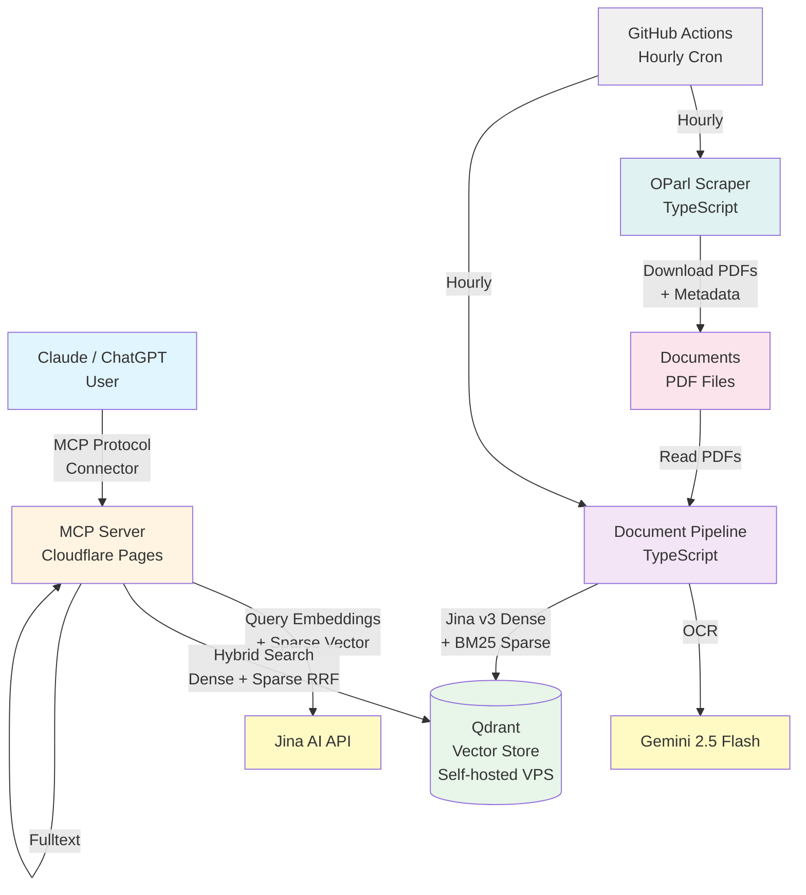

# Nordstemmen Transparent

**Durchsuche alle öffentlichen Dokumente der Gemeinde Nordstemmen mit KI-Unterstützung - direkt in Claude!**

## Jetzt sofort nutzen

Du kannst diese Suchmaschine **sofort kostenlos nutzen**, ohne irgendetwas zu installieren:

### Für Claude

1. Gehe zu https://claude.ai
2. Klicke auf dein Profil (unten links) → **Settings** -> **Connectors**
3. Klicke auf **Add Custom Connector**
4. Trage ein:
   - **Name**: Gemeinde Nordstemmen
   - **URL**: `https://nordstemmen-mcp.levinkeller.de/mcp`
5. Speichern

Fertig! Jetzt kannst du Claude fragen:
- *"Was kostet das neue Schwimmbad in Nordstemmen?"*
- *"Zeige mir alle Beschlüsse zum Baugebiet Escherder Straße"*
- *"Wann wurde der Haushalt 2024 beschlossen?"*

Claude durchsucht automatisch alle Dokumente seit 2007 und gibt dir Antworten mit Links zu den Originaldokumenten im Ratsinformationssystem.

### Für ChatGPT

Du brauchst einen bezahlten Account (z.B. Plus) und musst unter https://chatgpt.com/ eingeloggt sein.

1. Klicke auf dein Profil (unten links) → **Einstellungen** -> **Apps und Konnektoren**.
2. Unter **Erweiterte Einstellungen** den **Entwicklermodus** aktivieren (falls noch nicht aktiv). Danach auf **Zurück** klicken.
3. Rechts oben auf **Erstellen** klicken und Folgendes eintragen:
   - **Name**: Gemeinde Nordstemmen
   - **URL des MCP-Servers**: `https://nordstemmen-mcp.levinkeller.de/mcp`
   - **Authentifizierung**: Keine Authentifizierung
4. Die **Ich verstehe und ich möchte fortfahren**-Checkbox anklicken und auf **Erstellen** klicken.

Der Konnektor ist nun eingerichtet und bereit zur Verwendung. Öffne dafür einen **neuen Chat** und wähle über das **+**-Symbol links im Eingabefeld → **... Mehr** → **Gemeinde Nordstemmen** aus.

Beim ersten Aufruf einer Aktion musst du diesen aus Sicherheitsgründen bestätigen. Du kannst dabei die Option **Für dieses Gespräch merken** aktivieren, um die Anzahl der Rückfragen zu reduzieren.

---

## Was ist das?

Dieses Projekt ermöglicht semantische Suche in **allen öffentlichen Dokumenten** des Ratsinformationssystems der Gemeinde Nordstemmen:
- Sitzungsprotokolle (Gemeinderat, Ortsräte, Ausschüsse)
- Beschlussvorlagen und Beschlüsse
- Haushaltspläne und Finanzberichte
- Bebauungspläne und Planungsunterlagen
- Bekanntmachungen und Ausschreibungen

**Zeitraum:** Alle Dokumente ab 2007 bis heute (~5.800 PDFs, wird automatisch aktualisiert)

Die semantische KI-Suche findet relevante Informationen auch wenn die exakten Suchbegriffe nicht im Text vorkommen.

## Technischer Überblick (für Entwickler)

Das Projekt besteht aus drei Komponenten:

1. **OParl Scraper** — Lädt PDF-Dokumente und Metadaten vom Ratsinformationssystem herunter
2. **Document Pipeline** — Verarbeitet PDFs komplett: Gemini OCR → Jina Embeddings + Sparse Vectors → Qdrant
3. **MCP Server** — Cloudflare Pages Function für Hybrid-Suche (semantisch + Keyword) via Claude/ChatGPT

Dazu kommt eine **CI Pipeline** (GitHub Actions Cronjob), die stündlich neue Dokumente synchronisiert.

## Architektur



### Komponentenübersicht

| Komponente | Technologie | Zweck |
|---|---|---|
| **OParl Scraper** | TypeScript + Effect | PDFs + Metadaten von OParl-API herunterladen |
| **Document Pipeline** | TypeScript, async/await | PDF → Gemini OCR → Jina Embeddings + Sparse Vectors → Qdrant |
| **MCP Server** | Cloudflare Pages Functions | Hybrid-Suche (Dense + Sparse RRF), Volltext-Abruf |
| **Vector DB** | Qdrant (self-hosted) | Named Vectors: Dense (Jina 1024D) + Sparse (BM25-TF) |
| **OCR** | Gemini 2.5 Flash | PDF → Text (seitenweise) |
| **Embeddings** | Jina AI v3 (1024D) + lokale BM25-TF | Text → Dense + Sparse Vektoren |
| **Fulltext** | Cloudflare Static Assets | Volltext als `.txt`-Dateien im MCP-Server gebündelt |

### Warum Hybrid Search?

Die Suche kombiniert zwei Ansätze via **Reciprocal Rank Fusion (RRF)**:
- **Dense Vectors** (Jina v3, 1024D): Semantische Suche — versteht Bedeutung, findet "Schwimmbad" auch bei "Hallenbad"
- **Sparse Vectors** (BM25-TF, lokal berechnet): Keyword-Suche — findet exakte Namen ("Müller"), Nummern ("DS 101/2024"), Straßennamen ("Escherder Straße")

Sparse Vectors werden **lokal** aus dem Text berechnet (FNV-1a Hash, deutsche Stopwörter, keine API nötig). Der gleiche Tokenizer läuft in Pipeline und MCP Server.

### KI-Modell-Entscheidungen

**OCR — Gemini 2.5 Flash** wurde nach Vergleich mit GPT-4o und GPT-4o-mini gewählt:
- **Gemini**: Günstigste Option, keine Halluzinationen, verarbeitet auch gedrehte PDFs korrekt
- **GPT-4o**: Paraphrasiert statt zu transkribieren — schreibt Inhalte in eigenen Worten um und verfälscht die Bedeutung
- **GPT-4o-mini**: Verweigert gedrehte PDFs, überspringt Absenderblöcke, fast so teuer wie GPT-4o

**Embeddings — Jina v3 (1024D)**: Mehrsprachiges Modell mit guter Deutsch-Unterstützung. Task-spezifische LoRA-Adapter (`retrieval.passage` für Indizierung, `retrieval.query` für Suche).

## Repository-Struktur

```
nordstemmen-ai/
├── .github/workflows/
│   ├── data-sync.yml      # Stündlicher CI-Cronjob für Datenaktualisierung
│   └── claude.yml         # Claude Code Action
├── documents/              # Heruntergeladene PDFs und Metadaten (Git LFS)
│   ├── papers/            # Drucksachen (~1578 Verzeichnisse)
│   └── meetings/          # Sitzungen (~1087 Verzeichnisse)
├── scraper/               # OParl Scraper (TypeScript + Effect)
│   ├── src/
│   │   ├── index.ts       # CLI Entry Point
│   │   ├── scraper.ts     # OParl Scraper Logic
│   │   ├── client.ts      # HTTP Client
│   │   └── schema.ts      # OParl Type Definitions
│   └── package.json
├── pipeline/              # Document Pipeline (TypeScript)
│   ├── src/
│   │   ├── index.ts       # CLI Entry Point
│   │   ├── pipeline.ts    # Orchestrator
│   │   ├── ocr.ts         # Gemini OCR
│   │   ├── jina.ts        # Jina Embeddings (mit Semaphore)
│   │   ├── sparse.ts      # BM25-TF Sparse Vectors (lokal)
│   │   ├── qdrant.ts      # Qdrant Upload (Named Vectors: dense + sparse)
│   │   ├── cache.ts       # Cache + .completed Tracking
│   │   ├── rebuild-qdrant.ts  # Qdrant aus Cache neu aufbauen
│   │   └── migrate-sparse.ts  # Einmalige Migration (danach löschen)
│   └── package.json
├── mcp-server/            # MCP Server (Cloudflare Pages)
│   ├── functions/
│   │   └── mcp.js         # MCP Protocol Handler + 4 Tools
│   └── package.json
├── docs/
│   └── github-secrets.md  # CI Secret-Dokumentation
├── .env.example
└── README.md
```

## Setup

### Voraussetzungen

- **Node.js 22+** (für alle Komponenten)
- **Qdrant Instanz** (self-hosted oder Cloud)
- **Google API Key** (für Gemini OCR)
- **Jina AI API Key** (für Embeddings, https://jina.ai)
- **Claude Account** (Web oder Desktop App für MCP Integration)

### 1. Repository klonen

```bash
git clone https://github.com/levino/nordstemmen-ai.git
cd nordstemmen-ai
npm install

# PDFs herunterladen (Git LFS) — optional, nur wenn lokal verarbeitet werden soll
git lfs pull
```

**Wichtig:** Die PDF-Dokumente werden via Git LFS verwaltet. Das Repository nutzt einen eigenen LFS-Server (nicht GitHub LFS). Nach dem Clone muss `git lfs pull` ausgeführt werden, um die tatsächlichen Dateien herunterzuladen.

### 2. Umgebungsvariablen konfigurieren

```bash
cp .env.example .env
```

Bearbeite `.env` und füge deine Credentials ein:

```bash
# Qdrant Configuration
QDRANT_URL=https://qdrant.levinkeller.de
QDRANT_API_KEY=your-qdrant-api-key
QDRANT_PORT=443
QDRANT_COLLECTION=nordstemmen

# Pipeline: Gemini OCR
GOOGLE_API_KEY=your-google-api-key

# Pipeline + MCP Server: Jina Embeddings
JINA_API_KEY=your-jina-api-key
```

**Wo bekomme ich die Keys?**

- **Qdrant**: https://cloud.qdrant.io oder selbst hosten
- **Google API Key**: https://console.cloud.google.com (Generative Language API aktivieren)
- **Jina AI**: https://jina.ai

### 3. OParl Scraper

```bash
cd scraper
npm run scrape
```

Lädt neue/geänderte PDF-Dokumente und OParl-Metadaten herunter.

### 4. Document Pipeline

```bash
# Alle unverarbeiteten Dokumente verarbeiten
npm run pipeline

# Nur 10 Dokumente (zum Testen)
npm run pipeline -- --limit 10

# Nur auflisten, nichts tun
npm run pipeline -- --dry-run
```

Pro PDF: Gemini OCR → Jina Embeddings → Qdrant Upload. Die `.completed`-Datei wird erst geschrieben, wenn alle Schritte erfolgreich waren. Bei Abbruch werden beim nächsten Lauf nur die fehlenden Dateien verarbeitet.

### 5. MCP Server Deployment (Cloudflare Pages)

Der MCP Server ist eine Cloudflare Pages Function mit vier Tools:
- `search_documents` — Hybrid-Suche (Dense + Sparse RRF)
- `get_paper_by_reference` — Drucksache per DS-Nummer abrufen
- `search_papers` — Strukturierte Filtersuche
- `get_document_text` — Volltext per SHA256-Hash abrufen

**Deployment:** Automatisch via Cloudflare Pages bei Push auf `main`.

**Environment Variables** (Cloudflare Dashboard):
```
QDRANT_URL, QDRANT_API_KEY, QDRANT_PORT, QDRANT_COLLECTION, JINA_API_KEY
```

**Lokales Testen:**
```bash
cd mcp-server
npm run dev    # Dev Server starten
npm test       # Tests ausführen
```

### 6. Automatische Datenaktualisierung (CI)

Die Daten werden **stündlich automatisch** via GitHub Actions aktualisiert:

1. **Scraper** lädt neue Dokumente von der OParl-API
2. **Pipeline** verarbeitet neue PDFs (Gemini OCR → Jina Embeddings → Qdrant)
3. **Git Commit** speichert neue Dateien (LFS für PDFs/Embeddings)

**Manuell auslösen:** GitHub Actions > Data Sync > Run workflow

**Benötigte Secrets:** Siehe [docs/github-secrets.md](docs/github-secrets.md)

## MCP Tools

### `search_documents`

Hybrid-Suche (semantisch + Keyword) über alle Dokumente. Kombiniert Dense Vectors (Jina v3) und Sparse Vectors (BM25-TF) via Reciprocal Rank Fusion (RRF). Findet relevante Ergebnisse auch ohne exakte Keywords, und exakte Namen/Nummern zuverlässig.

```json
{"query": "Schwimmbad Kosten", "limit": 5}
```

### `get_paper_by_reference`

Drucksache per Nummer abrufen. Unterstützt Formate: "DS 101/2012", "101/2012", "101-2012".

```json
{"reference": "101/2012"}
```

### `search_papers`

Strukturierte Filtersuche nach Drucksachen (Titel, Typ, Datum, Nummernmuster).

```json
{"name_contains": "Haushalt", "date_from": "2024-01-01"}
```

### `get_document_text`

Volltext eines Dokuments per SHA256-Hash abrufen. Optional einzelne Seite.

```json
{"file_hash": "abc123...", "page": 3}
```

## Kosten & Performance

### Gemini OCR (Pipeline)
- Gesamte Erstverarbeitung (~5.800 PDFs): **~$60** (Tokenverbrauch bei komplexen Dokumenten mit Karten/Plänen deutlich höher als anfänglich geschätzt)

### Jina AI API (Pipeline + MCP)
- **Free Tier**: 1M Tokens/Monat
- **Pipeline**: ~$0,02 / 1M Tokens (Erstverarbeitung ~5-10M Tokens)
- **MCP Query**: ~50 Tokens pro Abfrage → ~20.000 Queries kostenlos/Monat

### Qdrant
- Self-hosted auf VPS
- ~6.000 Dokumente mit 1024D Vektoren

### Cloudflare Pages
- **Free Tier**: 100.000 Requests/Tag → effektiv kostenlos

## Datenschutz & Transparenz

- **Keine Nutzer-Tracking**: MCP Server speichert keine Queries
- **Öffentliche Daten**: Nur bereits öffentliche Dokumente aus dem Ratsinformationssystem
- **Open Source**: MIT License, voller Code auf GitHub
- **Unabhängiges Projekt**: Keine offizielle Gemeinde-Anwendung

## Status

**Das Projekt ist produktiv und funktionsfähig!**

- OParl Scraper (TypeScript + Effect)
- Document Pipeline (TypeScript): Gemini OCR → Jina Embeddings + Sparse Vectors → Qdrant
- MCP Server live unter https://nordstemmen-mcp.levinkeller.de/mcp
- 4 MCP Tools: Semantische Suche, DS-Lookup, Filtersuche, Volltext-Abruf
- ~5.800 PDFs indiziert (2007 bis heute)
- Stündliche automatische Datenaktualisierung (GitHub Actions CI)
- Volltext als Cloudflare Static Assets gebündelt

## Support & Beitragen

**Issues:** https://github.com/levino/nordstemmen-ai/issues

**Pull Requests sind willkommen!**

## Lizenz

MIT License - siehe [LICENSE](LICENSE)

---

**Hinweis:** Dies ist ein unabhängiges Transparenz-Tool und keine offizielle Anwendung der Gemeinde Nordstemmen.

**Entwickelt mit:** Claude Code
